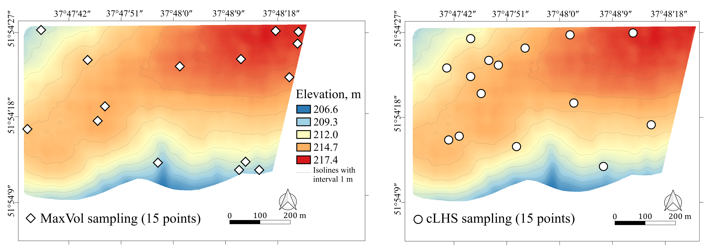

# maxvol-dataset-variability

> Repository for paper "Maximizing dataset variability in agricultural surveys with spatial sampling based on MaxVol matrix approximation"

Description

## Google Colab

How to run example of MaxVol soil-sampling based on environmental features?

Open `How_to_start.ipynb` in Google Colab!

To plot results of comparison of MaxVol, cLHS and Simple Random Sampling open `Plots.ipynb`

## Dependencies

**maxvolpy** - MaxVol python

https://pypi.org/project/maxvolpy/

**Whitebox-tools** - advanced geospatial data analysis

https://jblindsay.github.io/wbt_book/intro.html

## Installation

Clone this repository and create new `env` on your local machine

`https://github.com/petrovskaia/maxvol-dataset-variability`

Create new `env` with `gdal` package for MaxVol

`python -m venv maxvol`

Activate it

`source venv/bin/maxvol`

## Usage example

To run MaxVol soil sampling based on test DEM, terrain features and NDVI:

`$bash run_maxvol.sh --path_to_file ./DEM_files/dem.tif --path_to_output ./terrain --number_of_points 15`

## Meta

Anna Petrovskaia - Anna.Petrovskaia@skoltech.ru
Mikhail Gasanov – Mikhail.Gasanov@skoltech.ru

## License

Distributed under the MIT license. See ``LICENSE`` for more information.

## Contributing

1. Fork it (<https://github.com/petrovskaia/maxvol-dataset-variability/fork>)
2. Create your feature branch (`git checkout -b feature/fooBar`)
3. Commit your changes (`git commit -am 'Add some fooBar'`)
4. Push to the branch (`git push origin feature/fooBar`)
5. Create a new Pull Request

